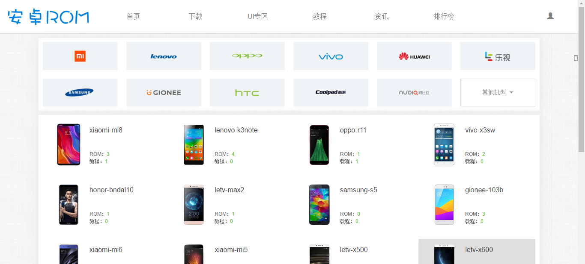
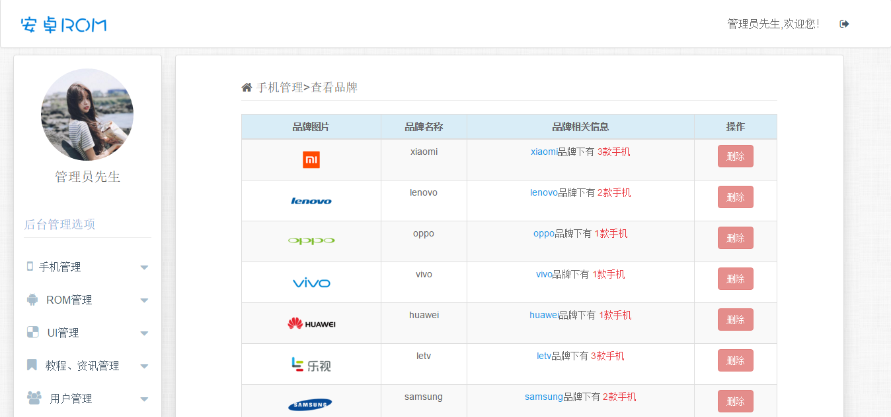

# 这是一个简易的ROM刷机包下载网站

## 网站在线预览
[前台在线预览](http://106.13.218.180:8080/ROMMS) <br>

[后台在线预览](http://106.13.218.180:8080/ROMMS/admin/adminLogin.jsp)
- 后台帐号:admin123456 <br>
- 密码:admin123456

## 运行环境

```html
jdk>=1.7
tomcat>=8.0
mysql>=5.5
```

## 项目部署

```html
1.  安装JDK并添加环境变量 <br>
2.  下载对应版本[tomcat](https://tomcat.apache.org/)并解压至任意目录，最好不要中文目录 <br>
3.  通过git clone克隆或者下载解压项目至tomcat站点目录，默认是weapps目录 <br>
4.  创建romms数据库并导入sql <br>
5.  打开WEB-INF\classes\applicationContext.xml，配置数据库的相关信息 <br>
6.  开启tomcat，浏览器访问localhost:8080/ROMMS <br>
7.  OVER!!!!!
```


## 网站效果图<br>
**前台：**<br>
**后台：**<br>